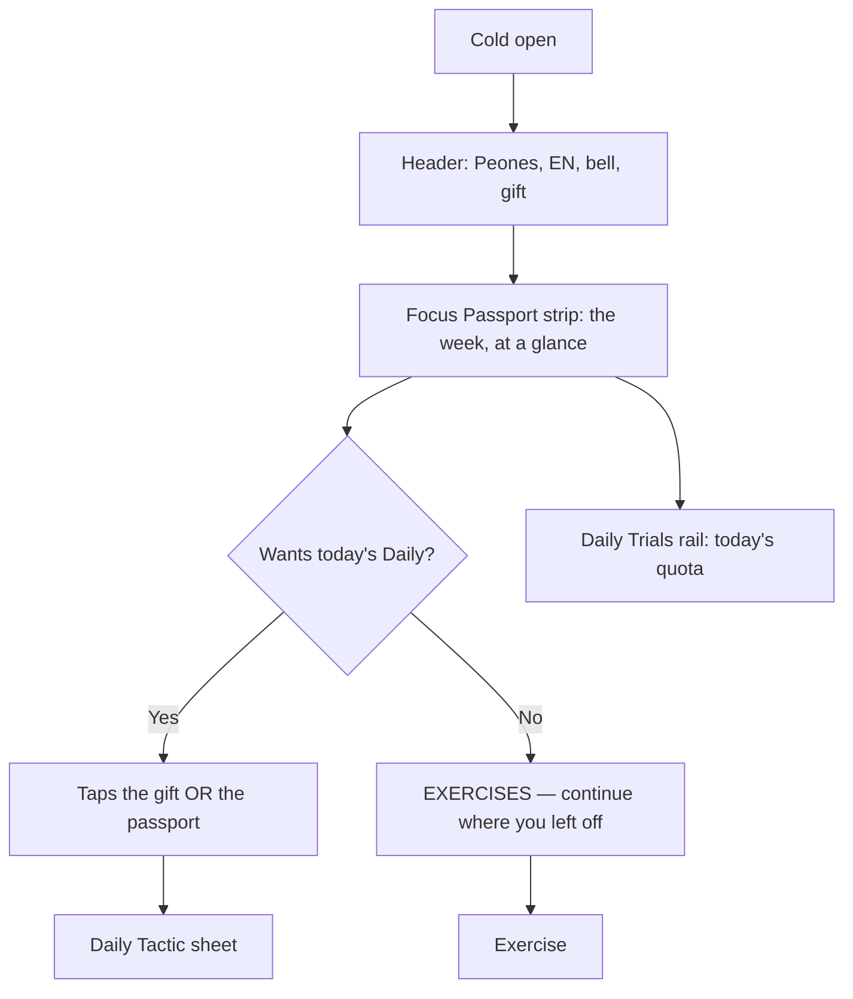

# LEARN Hub Revision — UX Specification

**Date:** 2026-08-30 · **Surface:** `/` (LEARN hub) · **Viewport:** 390 × 844 (MiniPay)

> **Mirror of the PLAY revision, not a copy of it.** PLAY's panel was a *brochure*
> — explanatory copy standing in for a render that had already shipped, so it was
> deleted outright. **The Focus Passport is a *record*.** Its seven flames are the
> only visible evidence that the player came back yesterday, in a product where
> 434 of 443 wallets played a single day. It is compacted, never removed.

---

## Executive Summary

### Key finding — ⚠️ CORRECTED, twice

**The first two versions of this section were measured against the wrong screen
and are retracted.** They claimed a 266 px card with a 78 px empty gap and "six
times its payload". Both numbers came from `/dev/learn-hub?variant=active`, which
renders the **21-Day Challenge** — a state production has not shipped since
2026-08-25, when the sale was paused.

⛔ **Root cause, and it repeated three times in one session:** the fixture did not
simulate the shipped state. It has four variants and none of them reaches
`progress.state === "unavailable"`, which is what `habitOnly` derives from. So the
four `vr18-learn-hub-*` baselines were photographing a screen nobody sees. Same
family as the Inbox slot the PLAY fixture omitted — but there a single element was
missing, here it was the whole STATE. **Fixed first (`variant=habit`), measured
after.**

Measured on `/dev/learn-hub?variant=habit`, 390 × 844 — the state that ships:

| Element | Height |
| --- | ---: |
| `Focus Passport` label | 29 px |
| Flame week (M–S) | 52 px |
| `Start Focus` CTA | 54 px |
| Padding + gaps | ~32 px |
| **Total** | **167 px** |

**There is no internal waste to reclaim.** The gaps are 6 px and 4 px; the card is
already tight. The only thing to remove is the duplicated CTA.

**Result, verified on device: 167 px → 109 px (−35%)** — label plus flames, nothing
else. The saving is the CTA, and only the CTA.

### Design Challenges

1. **The same duplication PLAY had.** `Start Focus` and the `Exercises` rail tile
   both call `router.push(startFocusExerciseDestination(piece))`. Same resolver,
   same destination, one screen.
2. **A subtitle that promises the wrong thing.** `Start Focus` is honest — its job
   is "continue where you left off", and that is what it does. Its second line,
   *"Complete your daily tactic"*, promises the Daily and delivers an exercise.
   ⚠️ **The defect is one line of copy, not the button.**
3. **The last green CTA on the surface.** The contract is explicit: green is the
   world, never a control.
4. **Two headers, one product.** LEARN still carries the trophy pill opening at
   `0`, a bold flag-and-code language chip, and 44 px icons — all three already
   corrected on PLAY.
5. **A rail label that will stop being true.** `LEARN PATH` describes a path; once
   `Exercises` is promoted out of it, what remains is a daily quota (`0/3 today`).

### Design Opportunities

1. **Compact, don't delete.** Passport **167 px → 109 px**, verified on device,
   without losing a single datum.
2. **One way to start learning**, exactly as PLAY has one way to start a match.
3. **Two hubs, one grammar.** After this, both are: header · brand · toggle ·
   world · primary CTA · rail.

---

## Core User Experience

### Defining Experience

Open Chesscito → see how many days you kept the streak → tap one button → be in
an exercise. The passport answers *"am I still going?"*; the CTA answers
*"where do I continue?"*. Nothing else on the screen has a job.

### Experience Principles

Inherited from the PLAY spec, unchanged, plus one this surface adds:

1. The hub earns its place by leaving fast.
2. One way to start the primary activity.
3. Show the world, don't describe it.
4. Never sell before the player has played.
5. The screen must teach itself.
6. **A record is not a panel.** Evidence of returning must stay visible, but it
   earns only the height its data occupies.

---

## User Journey Flows

⚠️ **The Daily keeps both of its entries.** The gift in the header and the tap on
the passport both open the Daily Tactic sheet. Removing `Start Focus` does not
orphan it — `Start Focus` never went there in the first place.

---

## Component Strategy

| Component | Today | Decision |
| --- | --- | --- |
| `ChallengeCard` (Focus Passport) | 266 px panel with a CTA inside | 🔄 **Compact to a strip (~111 px)**: label + flames + padding |
| `Start Focus` CTA (green) | Inside the card | ⛔ **Remove** — duplicate destination, and green is never a control |
| Its subtitle *"Complete your daily tactic"* | Under the CTA | ⛔ **Dies with it** — and must not be inherited by the new CTA |
| `LearnPathEntry` (`Exercises` tile) | First tile of the rail | 🔄 **Promote to the primary CTA**, purple, same craft as PLAY's DUEL |
| Rail (`LEARN PATH`) | 4 tiles incl. Exercises | 🔄 **Becomes `PROVING GROUNDS`** once Exercises leaves |
| `HubTour` (LEARN) | 3 steps, already down to 2 | ⛔ **Remove** — see below |
| Trophy pill | Header, opens at `0` | ⛔ **Remove** — same reasoning as PLAY |
| `LanguageChip` | Bold, framed, with flag | 🔄 `variant="bare"` — the variant already exists |
| Bell + gift | 44 px | 🔄 **36 px**, touch target unchanged at 44 |

**No new components.** `PrimaryPlayCta` stays untouched — six consumers, still
debt 1. The craft is copied, the component is not rippled.

---

## UX Consistency Patterns

### The rail's name — `PROVING GROUNDS`

**Decided (founder, 2026-08-30): `PROVING GROUNDS` / `CAMPO DE PRUEBAS`.**

A **place in the kingdom where you prove yourself** — which is what the whole hub
is built on (`<KingdomAnchor>` exists so the home *is* a place), and which links
to the rank ladder, `[Piece] Ascendant`: you prove yourself to ascend.

| Candidate | Rejected because |
| --- | --- |
| `MINI-GAMES` | Describes the format, hides the quota. And "too common" (founder) |
| `DAILY TRIALS` | Fine, but the cadence is already stated by the `0/3 today` sitting right below it |
| `THE GAUNTLET` | ⛔ **Does not survive translation.** `Guantelete` is the armoured glove, not the ordeal; the app ships EN **and** ES, so a label whose metaphor dies in one of them is not a label |
| `LUZ'S TRIALS` | ⛔ Luz is **monetised** — *"Train with Luz every day"* is the PRO pitch. Naming a free rail after her dilutes it |
| `CHALLENGES` | ⛔ **The word is triple-booked**: `Challenge Pass / PRO` (the product), `Pivot Challenge` (an item *in this very rail*), `Share Challenge` / `metaTitleChallenge` (the Daily Tactic), plus the 21-Day Challenge. A fourth meaning would break all four |

⚠️ **The founder wanted "challenges without saying challenges".** That is precisely
what this is — and the reason the word itself was unavailable is the table above.

**Translation parity is a naming constraint here, not an afterthought.**
`PROVING GROUNDS` → `CAMPO DE PRUEBAS` keeps the same image in both bundles.

### Inherited unchanged from PLAY

- **Button hierarchy** bound to the colour contract; exactly one primary per screen.
- **Header: two zones** — wealth left, access right, hairline dividers.
- **One glyph, one meaning**; count before adding.
- **Rewards are claimed where they are shown.**

---

## Responsive Design & Accessibility

### Vertical budget — measured, not derived

| Block | Now | After |
| --- | ---: | ---: |
| Header | 6–50 | unchanged |
| Brand + toggle | 56–265 | unchanged |
| **Focus Passport** | **279–446 (167)** | **279–388 (109)** ✅ done |
| World render | — | **~390–620** |
| **EXERCISES CTA** | — | **~620–690** (thumb zone) |
| Rail | — | floor |

⛔ **Do not repeat PLAY's layout trap.** A second `margin-top: auto` moved the
slack to the TOP instead of distributing it, leaving the wordmark floating over
~150 px of nothing. What worked was **enlarging the brand** so it occupies the
height. Reuse that, do not re-derive it.

### Accessibility

- The passport strip keeps its `?` and its tap-to-open-Daily target; compaction
  must not drop either, and both stay ≥ 44 × 44.
- Removing `Start Focus` removes a control — verify no focus order gap remains.
- **`/trophies` must keep an entry** if the trophy pill leaves. On PLAY the arena
  dock covers it; **verify the same holds for a LEARN-only player before shipping.**

### Testing

- VR: `--project=minipay --update-snapshots=none` first, always.
- The four `vr18-learn-hub-*` baselines will move. Re-record **once**, at the end.
- ⛔ Chips, flames and badges are anchored by DOM assertions, never by the photo:
  `hub-clean` tolerance is ~3.7× a typical chip.

---

## Open questions

All three are closed.

| # | Question | Resolution |
| --- | --- | --- |
| 1 | Rail name | ✅ `PROVING GROUNDS` / `CAMPO DE PRUEBAS` |
| 2 | Does the passport keep the `?` (tour replay)? | ✅ **No — the tour goes.** See below |
| 3 | Does a LEARN-only player still reach `/trophies`? | ✅ **Not re-litigated.** The criterion was settled on PLAY; LEARN follows it for consistency (founder: re-asking the same question adds nothing) |

## The LEARN mini-tour is removed

Same collapse as PLAY, and the code had already started it: `buildLearnHubTourSteps`
**already skips the Season Pass step** while sales are paused
(`skipChallengeStep = salesPaused && sellsThePass`). So a new player sees **two**
steps today, not three.

Promoting `Exercises` to the primary CTA takes the second one's subject away — the
step points at a rail tile that is now the loudest object on screen. **One step
remains, and a one-step tour is not a tour.**

⚠️ **It also contradicts the direction.** The founder's framing: *"más allá de
guiarles, me gustaría que las personas nos guíen"*. A tour is us guiding them.

**Originally three things competed for attention — the Daily, the Season Pass and
Exercises — and the tour existed to arbitrate between them.** The Season Pass is
retired (returning later as 3/5/7-day variants), Exercises becomes the dominant
CTA, and the flame strip explains itself. **Nothing is left to arbitrate.**

⛔ **Instrument the Daily entry before removing it**, exactly as
`app_mode_switch_tap` was added before the PLAY tour came out. If the Daily gets
found less often without the tour, that must be visible in the window rather than
arguable after it.
