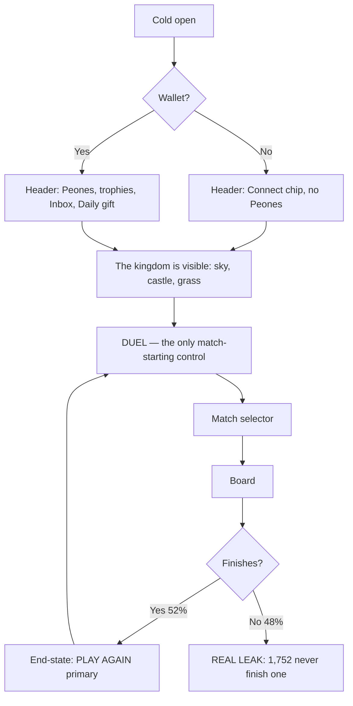
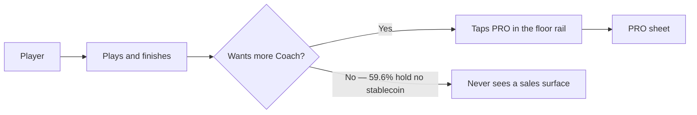

# PLAY Hub Revision — UX Specification

**Date:** 2026-08-30 · **Surface:** `/play-hub` · **Viewport:** 390 × 844 (MiniPay)

> **This is a revision, not a new direction.** The direction "A+ Kingdom Vivo"
> stays. `<KingdomAnchor>` — specified as *"a diegetic world render… the home
> becomes a **place**"* — now ships as the forest/castle background. The
> explanatory card written to stand in for it (`kingdom-card.tsx`) was never
> removed. This revision retires the scaffolding, it does not reopen the design.

---

## Executive Summary

### Project Vision

Chesscito's PLAY hub is a *place*, not a menu. The approved direction specified
a diegetic world render as the home's anchor. That render now ships as the
forest/castle background — but the explanatory card written to stand in for it
was never removed. This revision retires the scaffolding so the kingdom that was
built can be seen.

### Target Users

Two populations share one screen, and today the screen serves the wrong one:

- **First-timers** — the overwhelming majority: 434 of 443 wallets played on a
  single day. They need to reach a first match, not a product tour.
- **Returning players** — 6.5% at 7 days. They need to start a match and leave.

Both are served by the same answer: **one unmistakable way to start playing.**

### Key Design Challenges

1. **Four navigation grammars stacked** — mode toggle, panel, primary CTA and
   floor rail, all competing before the player knows where to tap.
2. **Onboarding content made permanent** — the panel's three entries
   (Quick Match / Coach Review / Rewards) are labels, not controls.
3. **A tutorial compensating for missing hierarchy** — the mini-tour existed
   because three elements claimed equal importance. Its apparent lift
   (64.6% vs 21.9%) is **selection, not causation**: the cohort that saw it and
   quit converts at 4.4%, and the "never saw it" group is 169 people out of
   6,177 — essentially those who left before it could render.
4. **PRO is sold to people who cannot pay** — 59.6% of players who reach the PRO
   sheet hold no stablecoin, yet one of three tutorial steps is dedicated to it.
5. **Icon saturation** — five crossed-swords marks on one screen; the "play"
   glyph repeats in every layer because no layer wins.

### Design Opportunities

1. **Delete, don't redesign.** Removing the panel and the tour reclaims ~40% of
   the viewport and drops the sword count from five to two.
2. **One way to start a match.** The purple DUEL bar becomes the single
   match-starting control; the floor rail becomes strictly "other places".
3. **Let the money signal cool.** PRO moves into the rail as one destination
   among three, in gold, instead of a permanent banner above the CTA.
4. **A screen that explains itself.** No-scroll at 390 px, with hierarchy doing
   the work the tutorial was doing.

### Decisions carried in from discovery

| # | Decision | Rationale |
| --- | --- | --- |
| D1 | **Kingdom card is removed** | The world render it substituted for now ships |
| D2 | **Mini-tour is removed, all 3 steps** | Step 1 explains the deleted card; step 2 sells $1.99 to a population 59.6% of which holds no stablecoin; step 3 points at a control that is now a 60 px bar |
| D3 | **`Warm-up` tile is removed** | Same puzzle as the Daily (`getDailyTactic`) but pays nothing and feeds no streak. The Daily survives as the header gift |
| D4 | **`Duel` tile is removed from the rail** | Duplicates the primary DUEL bar: same handler, same asset |
| D5 | **PRO moves into the floor rail** | One destination among three, in gold; no longer a permanent banner above the CTA |
| D6 | **No-scroll is a hard constraint** | Project-wide rule: every screen fits 390 × 844 unless it is a list or long-form content |

**Resulting floor rail:** `Coach · Shop` — two destinations, none of which
starts a match.

⚠️ **Amended the same day** (`sprint-change-proposal-2026-08-30.md`). This spec
originally put PRO in the rail and the implementation then added Trophies on top
of it. Both were removed:

- **PRO as an offer violates this spec's own Experience Principle 4** — "never
  sell before the player has played" — and the sale has been paused since
  2026-08-25. It survives ONLY for an active subscriber, where the tile is
  *status* (days remaining, the way back to the Journal), never a price.
- **Trophies opened at `0`** for almost everyone, which is precisely why it left
  the header. Moving that `0` to the floor does not change what it says.

⛔ **Root cause, worth more than either decision:** `.play-hub-path-grid` was
pinned at `grid-template-columns: repeat(4, 50px)`. The rail lost two tiles, the
grid kept reserving four, the gap read as "something is missing", and two
destinations were invented to fill it. **A hole in a layout is not a product
requirement.** The grid now sizes itself to the tiles.

---

## Core User Experience

### Defining Experience

Open Chesscito → see a kingdom → tap DUEL → be on a board. The hub is a
launchpad, not a destination. Its quality is measured by how quickly it stops
being on screen: 61% of arrivals already start a match, while only 52% of
started matches finish. The hub is not where the product is won — it is where
the product gets out of the way.

### Platform Strategy

- **MiniPay webview only.** 390 × 844 canonical; 360 × 640 is the store-required
  floor. Desktop is explicitly not a target.
- **Touch, one-handed, one thumb.** The primary control sits in the lower-middle
  third, within thumb reach; destinations that are not the primary action sit at
  the floor.
- **No scroll.** Project-wide rule for any screen that is not a list or
  long-form content. This is the budget every element competes inside.
- **Cold, intermittent sessions.** 434 of 443 wallets played on a single day: the
  screen must assume no memory of a previous visit and still need no tutorial.

### Effortless Interactions

- **Starting a match**: one tap from cold open, no disambiguation, no modal.
- **Playing again**: already shipped — instant replay from every end-state.
- **Claiming the Daily**: the header gift, unchanged; a reward should never
  require navigation.
- **Understanding where you are**: carried by the world render and the
  TRAINING/PLAY toggle, not by explanatory copy.

### Critical Success Moments

| Moment | Why it decides the outcome |
| --- | --- |
| **First match finished** | 1,752 players never finish one. Nothing else in the funnel matters until this moves |
| **Second match, same day** | Activation: 2.47× lift on return, reached by only 12.1% today |
| **The return itself** | 6.5% at 7 days — the number this whole revision exists to move |

A failure at the first moment makes every other surface irrelevant, which is why
the hub's job is speed, not persuasion.

### Experience Principles

1. **The hub earns its place by leaving fast.** Any element between the player
   and the board must justify the delay it causes.
2. **One way to start a match.** If a second control starts a match, one of them
   is wrong.
3. **Show the world, don't describe it.** The render carries the fiction; copy
   that explains the screen is a hierarchy failure in disguise.
4. **Never sell before the player has played.** 59.6% hold no stablecoin; the
   money signal waits at the floor, in gold, until it is asked for.
5. **The screen must teach itself.** If it needs a tutorial, it needs a redesign.

---

## User Journey Flows

### Journey 1 — First-timer: cold open to first finished match

The tour is gone, so the screen carries the whole burden of being understood.
Entry is anonymous; the world render establishes place before any control is
read; DUEL is the only control that starts a match.

> **⚠️ Known risk, accepted.** Tour step 1 was the only surface that named the
> TRAINING mode. Without it the toggle stays visible but unexplained. This is the
> single capability lost by removing the tour. It is accepted because the tour's
> apparent lift was selection rather than causation — but **it must be revisited
> if TRAINING entry rates fall during the measurement window.** Instrument the
> mode-switch tap before the window opens so the question is answerable.

### Journey 2 — Returning player: speed

Target: cold open to board in one tap, zero modals, no scroll. Everything else on
the screen is a destination, not a detour.

### Journey 3 — The money path, inverted

PRO stops interrupting and starts waiting. The player reaches it from the floor
rail after playing, rather than meeting it as a banner above the primary CTA and
as one of three tutorial steps.

### Journey Patterns

- **One match-starting control.** Any second control that starts a match is a bug.
- **Destinations live at the floor.** The rail is "other places"; it never starts
  a match.
- **Rewards never require navigation.** The Daily is claimed from the header.
- **The world fills the space.** Reclaimed vertical space stays as render, not
  widgets — a game home is mostly world (Clash Royale is village, Pokémon GO is
  map). Putting a widget in the reclaimed space would re-insert something between
  the player and the board, against Principle 1.

### Flow Optimization Principles

1. Steps to value: one tap, from cold.
2. No modal may stand between arrival and the primary control.
3. Selling happens on pull, never on push, and never before a first match.
4. The 48% who never finish a match are the target of the next cycle's work —
   this revision's job is to stop spending their attention before they get there.

---

## Component Strategy

### Component Inventory — the whole screen, decided

| Component | Today | Decision |
| --- | --- | --- |
| `KingdomCard` | Panel, ~40% of the height | ⛔ **Remove** |
| `HubTour` (3 steps) | Welcome modal | ⛔ **Remove** |
| `PlayTacticsTile` (Warm-up) | Floor-rail tile | ⛔ **Remove** |
| `HubActionTile` "Duel" | Floor-rail tile | ⛔ **Remove** — duplicates the bar |
| `play-chess-cta` (DUEL) | Purple CTA | ✅ **Keep and promote** — the only match-starter |
| `HubProBadge` | Inside the panel | 🔄 **Move to the floor rail** as a tile |
| `HubDailyTile` (gift) | Header | ✅ Unchanged |
| `InboxTrigger` | Header | ✅ Newly split, now photographable |
| `AppModeSwitch` | Toggle | ✅ Keep (⚠️ now unexplained — see Journey 1 risk) |
| HUD chips | 3 framed pills + 2 loose icons | 🔄 **Unify grammar** → UX Patterns |
| Kingdom render | Background | ✅ **Becomes the protagonist** |

### Design System Components

The design system is already live in `globals.css`; this revision adds no new
primitives. Everything above is reuse, relocation or removal.

Reused: `HubActionTile` (accepts `badge?: ReactNode`), `HubProBadge` (two states
with foot label: "Unlock" / "7d"), `HubDailyTrigger`, `InboxTrigger`,
`AppModeSwitch`, `play-chess-cta`, `ThemeAssetPicture`.

### Custom Components

**None required.** That is the strongest signal this revision is a removal rather
than a redesign: every surviving element already exists and is already tested.
`<KingdomAnchor>` — the one primitive the 2026-05-03 spec left at
"🟡 spec aprobada" — turns out to be satisfied by the shipped background render,
so it closes as ✅ live rather than as work to do.

#### PRO as a floor-rail destination

- **Purpose:** give the money signal a home that waits to be asked, instead of a
  banner above the primary CTA.
- **Anatomy:** `HubActionTile` with `HubProBadge` as its icon; label "PRO".
- **States:** guest / inactive ("Unlock" kicker) / loading / active (days badge).
  All four already exist in `HubProBadge` — no new art, no new logic.
- **Deliberately dropped:** the `$1.99` price pill. Price belongs in the PRO
  sheet, where the player arrived on purpose. Showing a price to a population
  59.6% of which holds no stablecoin spends attention without a path to
  conversion.
- **Accessibility:** the tile owns one complete accessible name; the badge is
  `aria-hidden`, the pattern the current PRO CTA already uses.

### Component Implementation Strategy

- **Delete before you design.** Four components leave the screen; one moves. No
  new component is introduced, so the blast radius is bounded by existing tests.
- **The rail means "other places".** After this change no rail tile starts a
  match, which makes the rail's meaning stable and the primary CTA unambiguous.
- **The render carries the fiction.** Reclaimed space stays as world.

### Implementation Roadmap

**Phase 1 — Removal (this cycle, before the measurement window opens)**

1. Remove `HubTour` from the PLAY hub and its three steps.
2. Remove `KingdomCard` from `play-hub-scaffold`.
3. Remove the `Duel` tile and `PlayTacticsTile` from the floor rail.
4. Add PRO to the floor rail → `Coach · Shop · PRO`.
5. Reposition the DUEL bar into the thumb zone (measurements in Responsive).

**Phase 2 — Header grammar:** unify the five header elements, which today speak
two visual languages.

**Phase 3 — Deferred, needs the window**

- PRO segmentation by balance (handoff decision 3.2).
- The 48% who never finish a match — the next cycle's real target.

⛔ **Instrumentation required before Phase 1 ships:** a mode-switch tap event, so
the accepted TRAINING risk from Journey 1 is answerable rather than arguable.

---

## UX Consistency Patterns

### Button Hierarchy

Bound to the measured colour contract, not to taste:

| Level | Treatment | Meaning | Instances allowed |
| --- | --- | --- | --- |
| Primary | Purple gradient (`--cta-primary-purple-*`) | The action of this screen | **Exactly one per screen** |
| Money | Gold (`--cta-primary-gold-*`) | Premium / payment | As needed, never above the primary |
| Secondary | Cream (`--cta-secondary-cream-*`) | Supporting, reversible | As needed |
| Never | Green | The world, never a control | Zero |

**Rule:** if two controls on one screen carry the primary treatment, one of them
is wrong. That is what made the old hub unreadable — PRO and DUEL wore the same
purple 80 px apart.

⚠️ **The contract governs control treatments, not illustration.** The art style is
gold-heavy throughout (wordmark, mascot ring, gift, bell). A gold *icon* is not a
money signal; a gold *button surface* is.

### Header Patterns — two zones, one rhythm

The header holds two semantic zones. The distinction is **semantic, not
mechanical**: every element is tappable, so interactivity does not separate them.
What separates them is what they *say*.

| Zone | Position | Says | Treatment |
| --- | --- | --- | --- |
| **Wealth** | Left | "this is what you have" | Framed pill, value inside |
| **Access** | Right | "this is what you can open" | Unframed glyph, divider-separated cluster |

**Composition (founder direction, 2026-08-30):**

`[♟ 2 +]` · · · · · `EN ˅ | 🔔 | 🎁`

**Rules:**

1. A wealth pill shows a real value. **Never display a placeholder or a floor
   value** — the balance is auditable, and a number the player cannot reconcile
   reads as a lie.
2. The access cluster is separated by hairline dividers so it reads as one
   deliberate group, not as leftovers.
3. Both zones share one vertical rhythm and a 44 × 44 minimum tap target.

**Trophies leave the header.** A `0` is the first thing a newcomer reads, and it
is a scoreboard of nothing. `/trophies` stays reachable through `TrophiesSheet`
in the arena — the reward is shown at the moment of the reward, not before the
first match. ⚠️ The header chip is currently the *only* entry to `/trophies` from
the hub; the arena sheet is the surviving path and must be verified before ship.

**A zero balance is not noise, it is a prompt.** `PEONES_WELCOME_PACK_AMOUNT = 1`:
new players are granted exactly one Peón for real. A `0` therefore means the
welcome gift is unclaimed — and the gift sits in the same header, two elements to
the right. The screen already states its own next action.

#### Header iconography — the access cluster

| Element | Asset | Render | Rationale |
| --- | --- | --- | --- |
| Locale | text + chevron | — | A setting, not a reward: stays typographic so it never competes with the two glyphs |
| Inbox | `shared.inbox-bell` (new slot) | ~40 × 44 | Gold-and-purple bell, same art register as the gift |
| Daily | `shared.welcome-gift` | 44 × 44 | Unchanged |

**Bell, not envelope.** The Inbox carries `announcement · achievement · gift ·
milestone` — three of the four are "something happened to you", which is
notification semantics, not correspondence. A bell also promises recurrence,
which is precisely what a population where 434 of 443 wallets play a single day
needs to be promised.

**⛔ The bell is news; the gift is a mechanic.** They sit adjacent and share an art
register, so the rule must be explicit: the 🎁 is the Daily and is *tapped to
claim*; the 🔔 is *read*. An Inbox message of type `gift` announces a gift — it
never replaces the Daily. Hairline dividers separate the two so the cluster does
not read as a row of prizes.

**Deliberate size difference:** the bell renders slightly smaller than the gift.
The Daily is a daily mechanic; the Inbox is intermittent news. The hierarchy is
intentional, not an artefact of the source aspect ratio (954 × 1059, i.e. 0.90).

**Asset requirements before ship:**

- Downscale from the 954 × 1059 source (never upscale).
- Emit `.png`, `.webp`, `.avif` plus `96w / 128w / 160w`, matching the
  `welcome-gift` family.
- Register `shared.inbox-bell` in the three `theme-registry` locations.
- ⚠️ The theme-slot **count** is pinned in three tests (46 → 47): all three must
  be updated in the same commit, or the suite goes red for a reason unrelated to
  the bell.

### Iconography Patterns

**One glyph, one meaning, one use per role.** The crossed-swords mark had five
instances on one screen because no layer won the hierarchy; the glyph was
repeated to compensate. After this revision it appears twice, in two distinct
roles:

| Instance | Role | Legitimate |
| --- | --- | --- |
| PLAY toggle | Mode identity | ✅ |
| DUEL bar | The action | ✅ |
| ~~Panel icon~~ | — | removed with the panel |
| ~~"Quick Match" label~~ | — | removed with the panel |
| ~~`Duel` rail tile~~ | — | removed as a duplicate |

**Rule:** a glyph repeated more than twice on one screen is a hierarchy failure,
not a branding decision. Count before adding.

### Navigation Patterns

- **One match-starting control per screen.** The floor rail never starts a match.
- **The floor rail is "other places".** Destinations only: `Coach · Shop · PRO`.
- **No modal between arrival and the primary control.** This retires the mini-tour
  and forbids its successors.
- **Rewards are claimed where they are shown.** The Daily never requires
  navigation.

### Feedback Patterns

- **Openers announce with a dot or badge, never with copy.**
- **Loading never blocks the primary control** — PRO's `loading` state resolves
  inside its own tile; the DUEL bar is never gated on a network read.
- **Selling is pull, never push.** No surface may present a price before the
  player has finished a first match.

---

## Responsive Design & Accessibility

### Vertical Budget — measured, not derived

Measured on device at 390 × 844 (`/dev/play-hub?variant=pro`, 2026-08-30).
`scrollHeight` was already 844: the screen fits today, so no-scroll is a
constraint to *preserve*, not to achieve.

| Block | Top | Height | Bottom |
| --- | ---: | ---: | ---: |
| Header | 6 | 44 | 50 |
| Wordmark + mascot + mode switch | 56 | 209 | 265 |
| Kingdom card (to be removed) | 279 | 186 | 465 |
| DUEL CTA | 495 | 76 | 571 |
| **Dead gap** | 571 | **171** | 742 |
| Floor rail | 742 | 84 | 826 |

⚠️ **Removing the card without repositioning makes the problem worse.** If the
card leaves and DUEL rises into its place (~279), the gap below DUEL grows from
171 px to ~387 px. The reclaimed space must be spent deliberately, or the screen
reads *more* unfinished, not less. This is the trap the revision must avoid.

### Target Layout

| Block | Top | Height |
| --- | ---: | ---: |
| Header | 6 | 44 |
| Wordmark + mascot + mode switch | 56 | 209 |
| **Kingdom render (breathing room)** | 265 | **~355** |
| DUEL CTA | ~620 | 76 |
| Floor rail (`Coach · Shop · PRO`) | 742 | 84 |

**Rationale:** the 355 px is not empty — it is the world render finally acting as
the `<KingdomAnchor>` the 2026-05-03 spec specified. Moving DUEL low also places
the primary action inside one-handed thumb reach, which the mid-screen position
never was.

### Breakpoint Strategy

- **390 × 844** — canonical. All measurements above.
- **360 × 640** — MiniPay store minimum. 204 px shorter: the kingdom breathing
  room absorbs the difference, keeping DUEL and the rail on screen.
  ⚠️ **Must be verified on `minipay-360`, not assumed** — the mascot block may not
  scale linearly.
- **Desktop** — explicitly not a target.

### Accessibility Strategy

**Target: WCAG 2.1 AA.**

- **Contrast, measured not estimated.** The gold PRO treatment was verified by
  compositing text alpha over both gradient stops: title 8.15:1, subtitle 5.33:1,
  chevron 4.54:1 at the worst stop. All pass. Any new treatment gets the same
  check before it ships.
- **Touch targets: 44 × 44 minimum.** The header gift already sits exactly at the
  floor; the bell matches it.
- **One accessible name per control.** The PRO rail tile owns its name; its badge
  is `aria-hidden` — the pattern the current PRO CTA already uses.
- **Removals must not orphan destinations.** `/trophies` loses its header entry;
  the arena `TrophiesSheet` is the surviving path and must be verified.
- **Screen-reader parity for the removed tour.** No focus trap disappears with it,
  but the TRAINING toggle is now unlabelled by any onboarding copy — its
  `aria-label` must carry the full meaning on its own.

### Testing Strategy

- **Visual regression:** `--project=minipay --update-snapshots=none` first, always.
  A green run with `none` is the only green that compared anything.
- ⛔ **Do not trust the VR for small elements.** `hub-clean` tolerance is
  `maxDiffPixelRatio: 0.005` ≈ 1,646 px on 390 × 844 — roughly 3.7× a typical
  chip. **Every chip, dot and badge in this revision is anchored by a DOM
  assertion**, never by the photograph.
- **Measure, don't eyeball.** Layout claims are verified with
  `getBoundingClientRect`, as the budget above was.
- **Fixtures must photograph what ships.** `/dev/play-hub` omitted `inboxSlot` and
  froze three baselines of a header with no envelope in it. Any prop the real hub
  passes, the fixture passes.

### Implementation Guidelines

- Relative units where the layout breathes; fixed values only for tap targets.
- The reclaimed vertical space is *render*, never a widget — see Journey Patterns.
- Instrument the mode-switch tap before shipping, so the TRAINING risk is
  measurable.

---

## Implementation Checklist

Ordered so the screen is never left in a worse state than it started. ⛔ Step 3 is
not optional after step 2 — removing the card without moving DUEL grows the dead
gap from 171 px to ~387 px.

| # | Change | Files | Risk |
| --- | --- | --- | --- |
| 1 | Instrument the mode-switch tap | telemetry + `AppModeSwitch` | none — must land first |
| 2 | Remove `HubTour` from the PLAY hub | `play-hub-client.tsx` | tour tests |
| 3 | Remove `KingdomCard`, reposition DUEL to ~620 | `play-hub-scaffold.tsx`, `globals.css` | ⛔ **must ship together** |
| 4 | Remove `Duel` tile + `PlayTacticsTile` from the rail | `play-hub-scaffold.tsx` | rail tests |
| 5 | Add PRO to the rail (`HubActionTile` + `HubProBadge`) | `play-hub-scaffold.tsx` | PRO state matrix |
| 6 | Trophies out of the header | `play-hub-scaffold.tsx` | ⚠️ verify `/trophies` via arena sheet |
| 7 | Header access cluster + `shared.inbox-bell` | `theme-registry.ts` (×3), art pipeline | ⚠️ slot count 46 → 47, pinned in 3 tests |
| 8 | Re-record the affected VR baselines, once | `visual-regression.spec.ts-snapshots/` | after 1–7, never during |

### Already landed before this spec was written (2026-08-30)

- ✅ `InboxChip` split into stateful chip + presentational `InboxTrigger`, and the
  `/dev/play-hub` fixture now passes `inboxSlot` — the vr17 baselines had been
  photographing a header without the Inbox in it.
- ✅ PRO row moved from purple to gold (`--cta-primary-gold-*`), resolving the
  two-purples-80px-apart collision. Contrast verified: 8.15 / 5.33 / 4.54:1.

### Open questions carried forward

| Question | Owner | Blocked on |
| --- | --- | --- |
| Does TRAINING entry fall once the tour is gone? | measurement window | step 1 instrumentation |
| PRO segmentation by balance (handoff 3.2) | John / product | the window |
| The 48% who never finish a match | next cycle | abandonment instrumentation |

**End of specification.**
